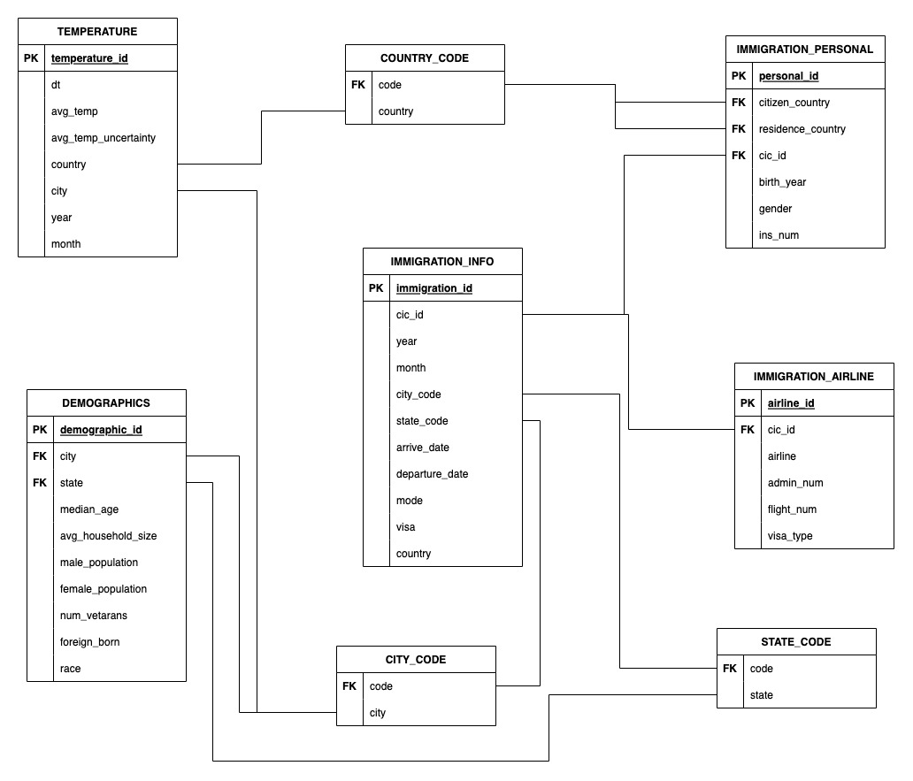

# Udacity Data Engineer Nanodegree - Capstone Project

The project revolves around designing a data warehouse by compiling datasets from 3 different sources 
and build a fact and dimensional model (start schema) to perform analytics on it. The final data model will be used for 
answer some key questions about these datasets. For example,
* How many tourists from a specific country visit the city of new york in a given year?
* Which airline is used the most for travelling?
* When do most of the tourist visit a specific city and its temperature in that month?
* What is the number of foreign born babies in the top 5 tourist destinations?

The three datasets are:
1. **I94 Immigration Data**: This data comes from the [US National Tourism and Trade Office.](https://www.trade.gov/national-travel-and-tourism-office).
2. **World Temperature Data**: This dataset came from [Kaggle](https://www.kaggle.com/berkeleyearth/climate-change-earth-surface-temperature-data).
3. **U.S. City Demographic Data:** This data comes from [OpenSoft](https://public.opendatasoft.com/explore/dataset/us-cities-demographics/export/).

The project follows the follow steps:

* Step 1: Scope the Project and Gather Data
* Step 2: Explore and Assess the Data
* Step 3: Define the Data Model
* Step 4: Run ETL to Model the Data
* Step 5: Complete Project Write Up

---

## Step 1: Scope the Project and Gather Data

### Scope
This project will integrate the above-mentioned datasets in a data warehouse with fact and dimension tables. Following
technologies will be used to perform the listed operations:
* **Data Storage:** Amazon Web Services Simple Storage Service (AWS S3) is 
used for storage as it is highly scalable, easy to manage and a cheap storage solution.
* **Exploratory Analysis:** Pandas is used because of the ease of use. We don't have much resource usage for 
exploratory analysis. We could have done this using PySpark too without any downside but its more of a personal 
preference to use Pandas.
* **Data Processing:** PySpark is the obvious choice here as the data we are going to deal with is huge and will 
require to communicate with AWS S3 for storage. Pyspark makes this easy.

| Purporse             | Tool/Technology                                     | Reason                                                                               |
|----------------------|-----------------------------------------------------|--------------------------------------------------------------------------------------|
| Data Storage         | Amazon Web Services Simple Storage Service (AWS S3) | Highly scalable, Easy to manage and cost efficient                                   |
| Exploratory Analysis | Pandas                                              | Personal Preference, We can use Pyspark for this too                                 |
| Data Processing      | PySpark                                             | Easy to connect with S3, Fast and efficient while dealing with large volumes of data |

### Some details about the datasets

| Data Set | Format | Description                                                                                                                                                                                                                                                         |
| ---      | ---    |---------------------------------------------------------------------------------------------------------------------------------------------------------------------------------------------------------------------------------------------------------------------|
|[I94 Immigration Data](https://travel.trade.gov/research/reports/i94/historical/2016.html)| SAS | Data contains international visitor arrival statistics by world regions and select countries (including top 20), type of visa, mode of transportation, age groups, states visited (first intended address only), and the top ports of entry (for select countries). |
|[World Temperature Data](https://www.kaggle.com/berkeleyearth/climate-change-earth-surface-temperature-data)| CSV | This dataset is from Kaggle and contains monthly average temperature data at different country in the world wide.                                                                                                                                                   |
|[U.S. City Demographic Data](https://public.opendatasoft.com/explore/dataset/us-cities-demographics/export/)| CSV | This dataset contains information about the demographics of all US cities and census-designated places with a population greater or equal to 65,000.                                                                                                                |

---

## Step 2: Explore and Assess the Data

### Exploratory Analysis Steps

1. Get an overview of the datasets (columns, type of data, data description).
2. Try to extract the relevant columns for our data model and get an overview of the tables.
3. Test the data reading and loading logic using spark

### Cleaning Steps

1. Check for Null values
2. Transform the date in datetime format for better readability
3. Parse description file provided to extract country, city and state codes
4. Transform columns to match their respective code

All of these steps are performed in the udacity workspace.
File paths are set accordingly.
---

## Step 3: Data Model

### Conceptual Data Model
We are going to use Star schema to model the data in fact and dimension tables like we have done in the previous
projects. The reason for this is the simplicity in design of a star schema. Every table has a clear purpose and will
help us in getting the answers to the business questions we asked previously.

* **immigration_info**: This is our Fact table. Contains all the relevant information about the immigration.
The data has been extracted from the I94 immigration dataset.
* **immigration_personal**: This is our Dimension table. Contains all the relevant 
information about the person immigrating. The data has been extracted from the I94 immigration dataset.
* **immigration_airline**: This is our Dimension table. Contains all the relevant 
information about the airline used for immigration. The data has been extracted from the I94 immigration dataset.
* **temperature**: This is our Dimension table. Contains all the relevant 
information about the temperature in US cities. The data has been extracted from the World Temperature Data from Kaggle.
* **demographics**: This is our Dimension table. Contains all the relevant 
information about the population in the US city. The data has been extracted from the US city demographic dataset.

---

## Step 4: Run Pipelines to Model the Data 

### Creating the Data Model
Spark was used to process the provided datasets and create the data model

### Data Quality Checks
We are going to perform two data quality checks here.
1. **Null check**: The data must be inserted in the tables. No table should be null
2. **Type/Integrity check**: The datetime columns must be in the right format, No date should be in string

### Data dictionary

#### Fact Table: immigration_info

* **cic_id**
  * Data type: double
  * The immigration department ID
* **year**
  * Data type: double
  * The travel year
* **month**
  * Data type: double
  * The travel year
* **city_code**
  * Data type:string
  * City code of the US city
* **state_code**
  * Data type: string
  * State code of the US city
* **arrive_date**
  * Data type: date
  * The date of arrival
* **departure_date**
  * Data type: date 
  * The date of departure
* **mode**
  * Data type:double
  * The mode of travel
* **visa**
  * Data type: double
  * The category of the visa
* **immigration_id**
  * Data type: long 
  * Primary Key of the data
* **country**
  * Data type: string
  * As we are dealing with US data, country is fixed to United States

#### Dimension Table: immigration_personal

* **cic_id**
  * Data type: double
  * The immigration department ID (Foreign Key to get the data from fact table)
* **citizen_country**
  * Data type: double
  * Country of citizenship of the person travelling
* **residence_country**
  * Data type: double
  * Country of residence of the person travelling
* **birth_year**
  * Data type: double
  * Year of birth of the person travelling
* **gender**
  * Data type: string
  * Gender of the person travelling
* **ins_num**
  * Data type: string
  * The INS number of the person travelling
* **personal_id**
  * Data type: long
  * Primary Key of the data

#### Dimension Table: immigration_airline

* **cic_id**
  * Data type: double
  * The immigration department ID (Foreign Key to get the data from fact table)
* **airline**
  * Data type: string
  * Airline used for travel
* **admin_num**
  * Data type: double
  * Admission Number
* **flight_number**
  * Data type: string
  * Flight Number
* **visa_type**
  * Data type: string
  * Type of visa
* **airline_id**
  * Data type: long
  * Primary Key of the data

#### Dimension Table: temperature

* **dt**
  * Data type: date
  * Timestamp of the temprature recorded
* **avg_temp**
  * Data type: string
  * Monthly average temperature
* **avg_temp_uncertainty**
  * Data type: string
  * Uncertainty in monthly average temperature
* **city**
  * Data type: string
  * City where the temperature was recorded
* **country**
  * Data type: string
  * Country where the temperature was recorded
* **temperature_id**
  * Data type: long
  * Primary Key of the data
* **year**
  * Data type: integer
  * Year when the temperature was recorded
* **month**
  * Data type: integer
  * Month when the temperature was recorded

#### Dimension Table: demographics

* **city**
  * Data type: string
  * City code
* **state**
  * Data type: string
  * State code
* **median_age**
  * Data type: string
  * Median age in the city
* **avg_household_size**
  * Data type: string
  * Average household size in the city
* **male_population**
  * Data type: string
  * Male population in the city
* **female_population**
  * Data type: string
  * Female population in the city
* **num_vetarans**
  * Data type: string
  * Number of veterans in the city
* **foreign_born**
  * Data type: string
  * Number of foreign born babies in the city
* **race**
  * Data type: string
  * Majority race of the city
* **demographic_id**
  * Data type: long
  * Primary key of the data

#### Table: country_codes

* **code**
  * Data type: string
  * The abbreviated code
* **country**
  * Data type: string
  * Country name

#### Table: city_codes

* **code**
  * Data type: string
  * The abbreviated code
* **city**
  * Data type: string
  * City name

#### Table: state_codes

* **code**
  * Data type: string
  * The abbreviated code
* **state**
  * Data type: string
  * State name

---

## Step 5: Complete Project Write Up

### Data Complexity Checks
1. **At least 2 data sources**: We are using data from 3 sources as described above.

2. **More than 1 million lines of data**: We have over 3 million data rows in the immigration_info tables
    
3. **At least two data sources/formats (csv, api, json)**: We are reading data from CSV and SAS formats.

### WHAT IF's
1. What if the data was increased by 100x?
    AWS EMR cluster needs to be used to handle such a change as it has the capicity to handle such large data.
	
2. What if the pipelines would be run on a daily basis by 7 am every day?
	Apache Airflow can be used to design and handle scheduling of the pieplines and streamline this process.

3. What if the database needed to be accessed by 100+ people?
	Amazon Redshift can be used to handle such requirement as it allows simultaneous connections

### Data Update Frequeency
* I94 immigration dataset and world temperature dataset has aggregated data on monthly basis,
so following tables should be updated monthly:
  * immigration_info
  * immigration_personal
  * immigration_airline
  * temperature
  
* The US city demographic dataset is aggregated on the yearly basis so demographics table can be updated yearly.
* We should make sure that we append data to the tables. Overwriting will cause data loss.

### How to run
1. Early inspection is carried out step by step in the inspection.ipnyb file.
2. We can run the project step by step using the data_procesing.ipnyb file.
3. We can run the data_procesing.py file by running `python3 data_processing.py` command on terminal.

### Results
* We ran the query to get the number of people from Pakistan visitng New york and 
found that 1380 have visited New York from Pkaistan in 2016.
* We ran the query to get the number of people from Pakistan visitng any city and got results for various cities like:
  * CHARLOTTE : 20 people
  * DETROIT: 142 people
  * AUSTIN: 3 people
  * LOS ANGELES: 343 people
  
---